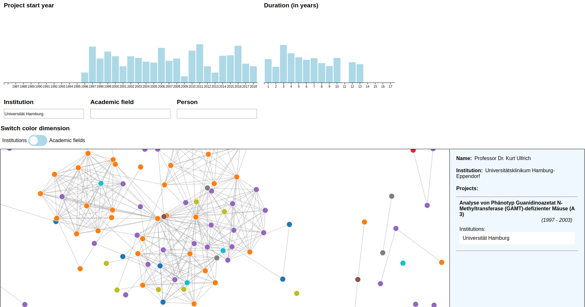
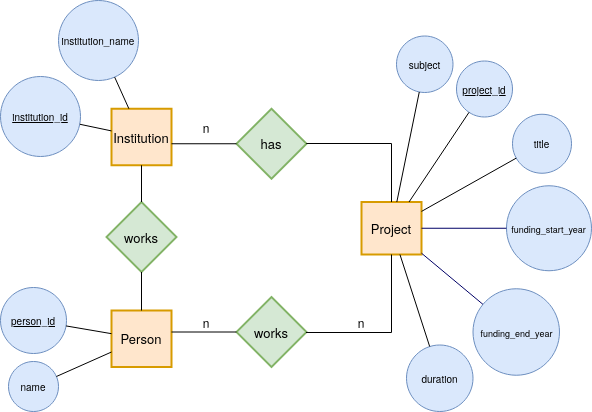
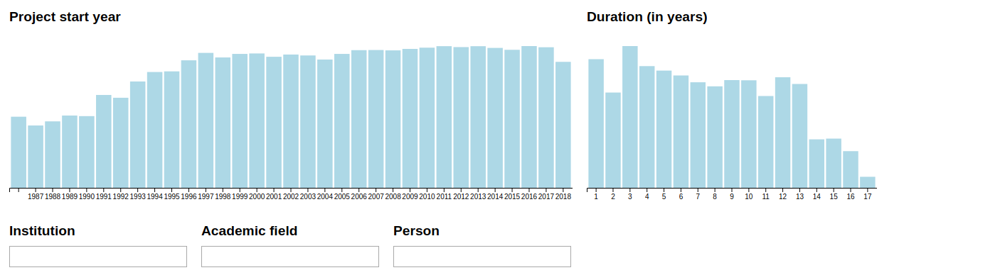
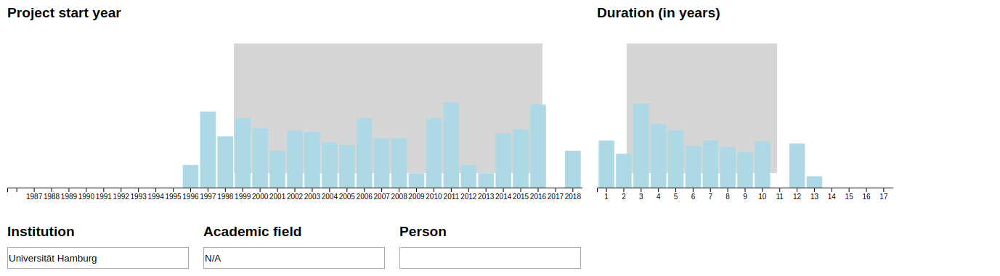
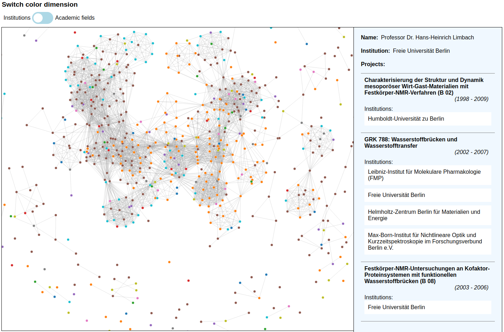

# Visualization tool for exploring network connections in the DFG data

---

We build a visualization tool with d3 for exploring connections from scientist in the DFG (Deutsche 
Forschungsgemeinschaft) data including multiple filtering options for the user.  

## Table of contents:

1. [ Project description ](#project_description)
2. [ Installation ](#install)
3. [ Manual ](#manual)
4. [ Contributors ](#contributors)
5. [ Data copyright](#copyright)

## Project description

"Your network is your net worth." -- Porter Gale. We all know the importance of networking in science but often neglect it.\
"How might we help someone figure out another scientist's network?"\
That is the question we asked ourselves at the start of this project. But it is not just professors that can find themselves
in this situation - universities with an open chair, ambitious post-graduates looking for a mentor to guide them
for a while, even students choosing which one of the country's many researchers they should contact with a thesis idea:
They all need to take their person of interest's network into account. Simply type in the name and hit the button! We allow filtering for universities, academic fields and the dates and duration of projects jointly worked on. Mostly interested in the connections crafted in the last three years? No problem! Lots of projects with researchers from all over, but how many of these were at elite universities? We'll show you! Desperately looking for an addition to your team that can connect you to a Marine scientist? Now you can find out who best fits that need! All just a click away! And should you just want to browse through your university's staff, looking for some interesting connections, you have come to the right place! We allow you to selectively filter through the entire domain of DFG-funded researchers to find just what you are looking for.\
We do not know what constitutes a 'valuable' connection or a 'well-connected' scientist. Those are highly subjective
questions that one can only answer for themselves. We provide the tool for you to analyse that which cannot
be seen in a CV or heard in an interview or talk - we visualise networks.

#### Domain problem characterization

Our group of target users consists of anyone with an interest in the relationships between various DFG researchers.
As mentioned above, this applies mostly to universities and professors looking to fill a vacancy or evaluate possible
collaborations respectively. But pre- and post-graduates as well as the DFG itself can profit from utilising this visualisation
to aid their decision-making process. These relations can be evaluated from different angles, such as the number and depth
of collaborations, the institutions associated, the academic field the collaboration falls under or how recently
those relationships were forged. While this data is mostly freely available, it is a lot to take in and cannot
reasonably be stored in a person's memory for evaluation.

#### Data / task abstraction

We used the java script library d3 (https://github.com/d3/d3) to create a dynamic, interactive data visualization. Our starting point were the gepris dfg data from which we derived the data for our visualization. Following ypu can see the ER model of our data:

We have splitted the data in three tables. One table contains all the data we need for the filtering process (filtered_data.csv). For the filtering we are using the crossfilter2 library (https://github.com/crossfilter/crossfilter) which enables fast filtering over different filter dimensions. The filter process returns a list of projects, which satisfy the selected filter options. We use the second table (filtered_persons_projects.csv) which contains the connection between the projects and the people and the list of projects to get the information who worked in the selected projects. Furthermore we calculate links between the persons. We create links between persons who work together in a project and if they work together in multiple projects we account this. \
Now we are ready for the network visualization: we draw a force directed graph with d3. The nodes represent the person and the links are the calculated connections between them. We enrich the node data with the third table (nodes.csv) including the person names and their institutions. \
The user can interact with the visualization in many different ways. For example he can zoom into the network, select a node by hovering over it and see additional information to the person on the a sidebar. Also he can grab a node and change his position. To learn more about the different interaction possibilities see the [ Manual ](#manual). Note that we do not aim to analyse our data but instead to aid analysis through visualisation.    

#### Visual encoding / interaction design:
As we aim to visualise potentially very complex relations between people, a network presented itself as the best option.
Due to the number of connections we wish to display, only a heatmap would have been a possible alternative. This option was disregarded because it seemed less intuitive and because most datsets displayed will be rather small, which works better with a network. Research into the comparison of networks yielded no results that we believed to constitute an easily understandable
visualisation. As evaluating relationships is a very multi-faceted and deeply subjective task we aimed to give the user as much control as possible over the choice of which aspects of the people involved she wants to visualise. We identified the number of
collaborations shared with another person, that person's home institution and research field as well as the years
in which the collaborations took place and their duration as fields of interest that can be selected by. Other data, such as e-mail address of the people involved, while available seemed irrelevant. Thus, they have been omitted which also greatly reduces cluttering of information.\
The values of all the variables identified as relevant are broken into bins by which the user can select and combine at will. The data is thus interactively picked and observed. The binnings are intuitive and require no further explanation. As part of our maxim of handing control over to the user we decided to allow free roaming of the variable space. This allows the user to explore and compare what type of networks researchers that she has not previously taken into account have.

#### Algorithm design
We used a force-directed graph drawing algorithm to minimise edge-crossings and keep the graph as easily accessible by the human eye as possible. The thickness of the links between researchers reflects the intensity of their collaboration - the more projects shared, the thicker the line. Differing degrees of thickness are distinguishable by the human eye. Although differing lengths are known to be more easily distinguished, this would have influenced the shape of the graph and made it confusing. As to avoid cluttering of the screen, the networks are not shown until the data is sufficiently filtered (down to 1000 nodes). This also helps keep the computational costs low enough as to avoid performance issues.

#### Limitations
Due to time constraints we were not able to include all our ideas. Among them, the ones we would most like to have included are split screens to a)view two or more networks at a time for comparison (small multiples, owing to the Eye over Memory principle) and b) to show a person's home institution as well as academic field at the same time instead of having to toggle between those pieces of information. Small icons next to or inside the nodes, depicting the scientist's academic field would have also been a viable alternative to b). We would further have liked to introduce a binning for the width of the links between our nodes, as to make the differentiation between them more visible. It would also have been our wish to make the links display more information: clicking on a link could open a small window which lists the projects that the researchers on both ends of it have collaborated on. One necessity we missed out on due to time constraints was the display of a colour legend, explaining which node colour corresponds to which institution or academic field.

#### Validation
We showed our visualisation to another person with only the introduction that  this was a tool to visualise networks of DFG funded researchers. We learned a lot. For the uninitiated, the project start year and duration bar chart selection interface was very confusing. It was suggested to put the search bars on top. Our colour dimension was also not noticed for a long time and not intuitively understood. A further point of confusion was the fact that merely glossing over a node with the mouse leads to opening of the information sidebar on that person. Which node was expanded in the sidebar was not apparent and we should definitely introduce a highlighting feature for currently active node. Generally speaking, our visualisation's biggest drawback was a lack of guidance on how to use it.\
Based on our validation, the threats mentioned in Munzner's 2009 paper were avoided. Our interaction technique was well received, although we should have given a better introduction to how it works. But once understood, the great degree of freedom offered to the user invited playing around with our visualisation. Our test person stated that this was a more intuitive and fun to work with approach than a heatmap or simple listing of connected people. The test person was generally interested in our tool and believed others would be too, although more research would have to be done to truly validate this.

## Installation

1. In folder "/d3" install dependencies with command: `npm i`
2. Start server with `npx http-server .`
3. Open http://localhost:8080/ in browser (default port)

## Manual

The visualization tool is structured in two main areas: the filtering and the exploring area.   

__1. filtering area:__

In the filter area there are filter options in five different dimensions: "Project start year", "Duration (in years)", "Institution", "Academic field" and "Person".

For filtering the dimensions "Project start year" and "Duration (in years)" you have to select an interval in the bar charts. The dimensions "Institution", "Academic field" and "Person" can be filtered by the text fields which support autocompletion and drop down features. Deselection is possible by clicking onto a bar chart or removing the text by the text fields. The filter (bar charts and autocomplition) adjust and show only the data which match to the selected filter. Here you can see an example filter and the resulting bar charts:      

__2. exploring area:__

In the exploring area the network graph will be shown if the selected filter data include less than 1000 persons (due to performance reasons). If more than the required persons are selected you will see the following message:  

If in the filtered data are less than 1000 persons the network graph for the specific filter will be shown. Here you can see an example graph for all persons who worked in projects of the "Freie Universität Berlin":

Every node represent one person and the links between nodes will be drawn if persons worked together in a project. The width of the links encode the amount of projects they have worked together. The user can zoom into the graph and navigate via mouse. If he hovers over a node informations of this person will be displayed on the right side. This inforamtions includes the name of the person, the institution for which the person is working and a list of all projects the person worked in. The informations for a project includes the project name, the start and end year, if present the subject area and all institutions which where involve to this project.     

## Contributors

- Nils Hutmacher (https://github.com/Nilshut)
- Iason Simson-Lagaris (https://github.com/iasonAdvAlg)

## Data copyright

Data derived from original data provided by https://gepris.dfg.de (c) Deutsche Forschungsgemeinschaft
